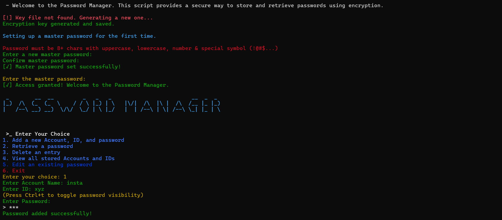
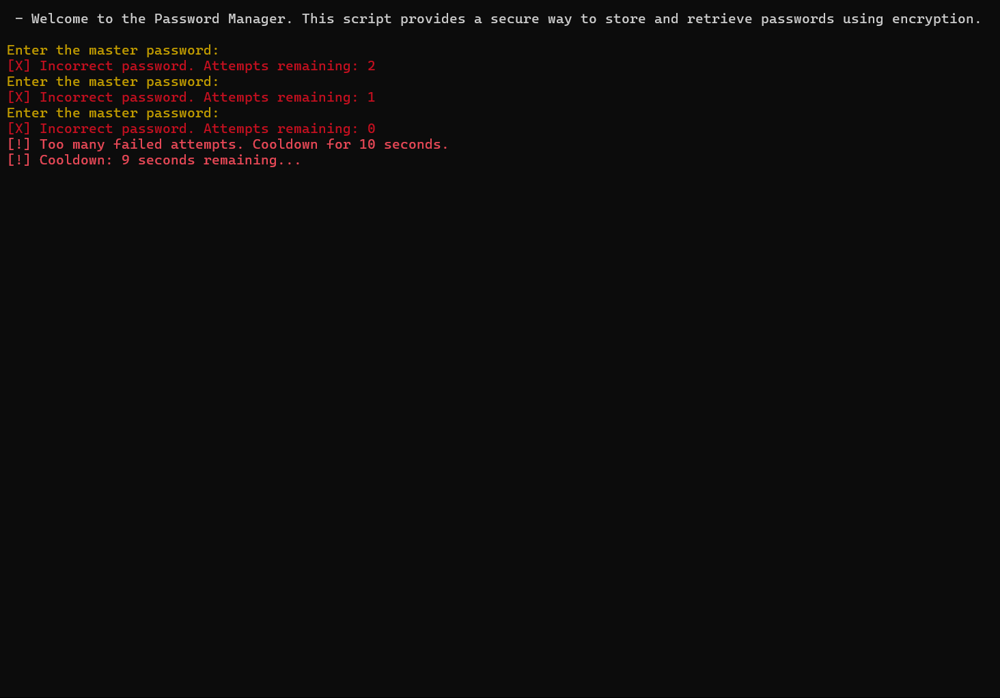

#  🔐 Password-Manager
This is a Python-based password manager script provides a secure way to store and retrieve passwords using encryption.

## 📸 Preview

<table>
<tr>
<td align="center"><b>✅ First-Time Setup</b><br></td>
<td align="center"><b>❌ Incorrect Login Attempt</b><br></td>
</tr>
</table>

---

## 🚀 Features

- AES-encrypted password storage 🔒  
- Master password authentication 🧠  
- User-friendly terminal UI with colorful prompts 🎨  
- Add, retrieve, delete, and update credentials  
- Cooldown after multiple failed logins 🔁  
- Secure key generation and storage 🔑  

---

## 💻 Installation


```
git clone https://github.com/KunalDharme/Password-Manager.git 
cd Password-Manager
pip install -r requirements.txt
python3 id-pass.py
```
   
### How To Use Password-Manager ?
    
Here is a quick guide to using your password manager:
    1. Set up a Master Password: The first time you run it, you'll set a master password. This is used to protect your passwords.
    2. Login: After that, you will need to enter your master password to access the program.
    3. Main Menu:
       1: Add a new account, ID, and password.    
       2: Retrieve a stored password.
       3: Delete an entry (account or ID).
       4: View all stored accounts and IDs.
       5: Save and exit the program.
    4. Storing Passwords: The program encrypts your passwords for security, and you can add, retrieve, or delete passwords as   needed.
    5. Exit: When you are done, choose 5 to save your data and exit.

⚠️ NOTE : Remember, do not forget your master password—you need it to access your passwords!

---

## License
This project is licensed under the MIT License.

---

## Author
Developed by Kunal Dharme.
